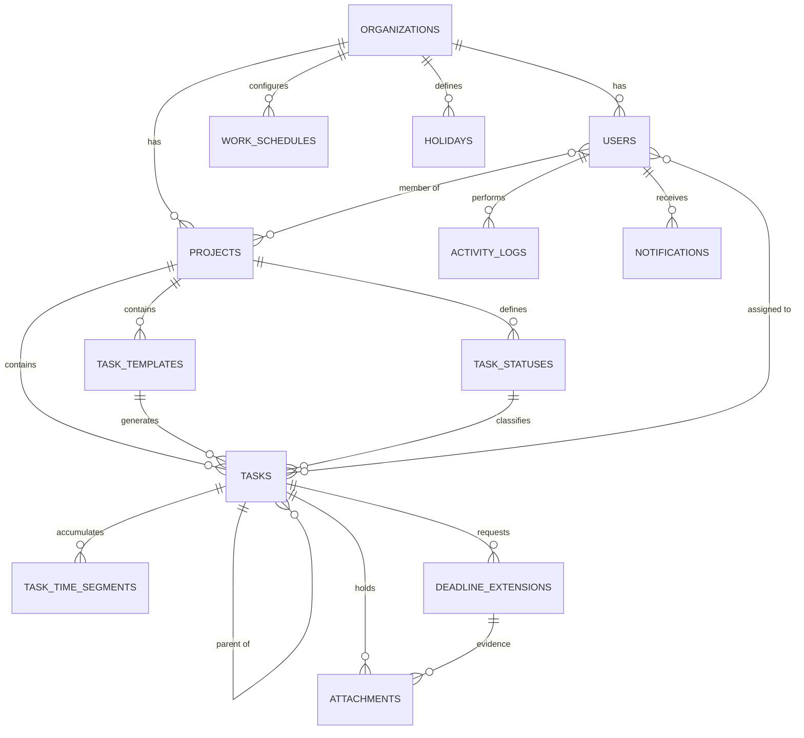

# 02 — DATA MODEL (REVISI 2)

> **DB:** MySQL 8 · **ORM:** Eloquent · **Charset:** `utf8mb4_unicode_ci`
> **TZ:** **`Asia/Jakarta` (WIB)** di DB dan tampilan — **F-69**. Tidak ada konversi UTC di mana pun
> **Revisi:** 2026-07-15 — pasca keputusan F-28..F-37 + 6 fitur tambahan Boss
> Ini **ground truth skema**. Beda antara kode dan file ini = **LAPOR BOSS**.

---

## 1. PRINSIP — WAJIB, TIDAK BISA DINEGO

| ID | Aturan |
|----|--------|
| **F-5** | `organization_id` di SETIAP tabel bisnis, sejak baris pertama. Jangkar v3.0. |
| **F-15** | Global scope `OrganizationScope` di semua model bisnis. Query tanpa scope = **bug keamanan**. |
| **F-16** | Soft delete di `users`, `projects`, `tasks`. Hard delete DILARANG — data KPI. |
| **F-17** | Tabel jamak · kolom `snake_case` · FK `<singular>_id`. Konvensi Laravel, jangan kreatif. |
| **F-22** | Activity log via **Eloquent Observer**, BUKAN panggilan manual. |
| **F-23** | `activity_logs` IMMUTABLE. Tidak ada update, tidak ada delete. Selamanya. |

### 🔴 F-38 — COUNTER = CALCULATED, BUKAN STATEFUL
**JANGAN** simpan "counter berjalan" sebagai state. **JANGAN** bikin scheduler per menit.
Simpan **timestamp**, hitung **saat ditanyakan**. Pause/resume terjadi sendirinya karena jam di luar jendela kerja tidak masuk hitungan.
**Alasan:** scheduler mati / cron telat = counter korup permanen. Timestamp tidak bisa korup.

### 🔴 F-39 — FREEZE ANGKA SAAT APPROVED
Saat task masuk status `is_completed` **dan** di-approve:
- `actual_minutes` → **dihitung sekali, disimpan permanen**
- `rejection_count` → **dibekukan**

**Alasan:** kalau dihitung on-the-fly dari config aktif, satu klik di menu Pengaturan **menulis ulang sejarah KPI seluruh tim**. Di v2.0 itu = menulis ulang gaji yang sudah dibayar (**F-3 risiko legal**).
**ATURAN INDUK: angka yang sudah jadi dasar penilaian TIDAK BOLEH berubah retroaktif. Selamanya.**

### 🔴 F-40 — `work_schedules` VERSIONED
Ubah jam kerja = **INSERT baris baru** dengan `effective_from` baru. **BUKAN** update baris lama.
Task aktif → pakai config aktif. Task selesai → sudah frozen (F-39).

### 🔴 F-41 — REALISASI = Σ SEGMEN
`task_time_segments` adalah sumber tunggal realisasi kerja. Bukan `activity_logs` (rapuh, harus parsing json).
Masuk work-state → segmen baru. Keluar → tutup segmen. Realisasi = jumlah overlap semua segmen dengan jendela kerja.

---

## 2. ERD



---

## 3. TABEL

### 3.1 `organizations`
| Kolom | Tipe |
|-------|------|
| `id` | bigint PK |
| `name` | varchar(150) |
| `slug` | varchar(150) UNIQUE |
| `timestamps` | |

---

### 3.2 `work_schedules` — F-40
Jendela kerja perusahaan. **Versioned, jangan pernah di-update.**

| Kolom | Tipe | Ket |
|-------|------|-----|
| `id` | bigint PK | |
| `organization_id` | bigint FK | F-5 |
| `effective_from` | date | mulai berlaku |
| `days_of_week` | json | `[1,2,3,4,5]` = Sen–Jum (ISO: 1=Sen, 7=Min) |
| `start_time` | time | default `08:00` |
| `end_time` | time | default `17:00` |
| `daily_capacity_minutes` | smallint | default **480** (8 jam) |
| `created_by` | bigint FK | |
| `timestamps` | | |

**UNIQUE(`organization_id`, `effective_from`)**
**Config aktif** = baris dengan `effective_from <= today`, urut desc, ambil 1.

> **F-42:** `daily_capacity_minutes` **boleh beda** dari `end_time - start_time`. Jendela = kapan boleh kerja. Kapasitas = berapa lama dianggap produktif. Contoh: jendela 08–17 (9 jam), kapasitas 480 (8 jam) — 1 jam istirahat.

---

### 3.3 `holidays` — v0.8
Tabel dibuat di v0.5 (kosong). Diisi & dipakai di v0.8.

| Kolom | Tipe |
|-------|------|
| `id` | bigint PK |
| `organization_id` | bigint FK |
| `date` | date |
| `name` | varchar(100) |
| `timestamps` | |

**UNIQUE(`organization_id`, `date`)**

> **F-43:** Libur nasional **ditunda ke v0.8** — dampaknya beberapa hari setahun, dan **bisa dihitung mundur** dari timestamp yang sudah tersimpan (F-38). Tabel disiapkan sekarang agar tidak perlu migrasi ulang.

---

### 3.4 `users`
| Kolom | Tipe | Ket |
|-------|------|-----|
| `id` | bigint PK | |
| `organization_id` | bigint FK | F-5 |
| `name` | varchar(120) | |
| `email` | varchar(150) UNIQUE | |
| `password` | varchar(255) | |
| `role` | enum(`admin`,`member`) | Guest → v1 |
| `employment_type` | enum(`internal`,`freelance`) default `internal` | hook v3.0 |
| `daily_capacity_minutes` | smallint NULL | **override per user.** NULL = pakai `work_schedules` |
| `is_active` | boolean default true | |
| `timestamps`, `softDeletes` | | |

---

### 3.5 `projects`
| Kolom | Tipe |
|-------|------|
| `id` | bigint PK |
| `organization_id` | bigint FK |
| `name` | varchar(150) |
| `description` | text NULL |
| `owner_id` | bigint FK → users |
| `is_archived` | boolean default false |
| `timestamps`, `softDeletes` | |

---

### 3.6 `project_user` (pivot)
`project_id` · `user_id` · `timestamps` — **UNIQUE(project_id, user_id)**

---

### 3.7 `task_statuses` — TIGA FLAG

| Kolom | Tipe | Ket |
|-------|------|-----|
| `id` | bigint PK | |
| `organization_id` | bigint FK | F-5 |
| `project_id` | bigint FK | |
| `name` | varchar(50) | |
| `color` | varchar(7) | hex |
| `position` | smallint | urutan — **dipakai validasi transisi (F-45)** |
| `is_work_state` | boolean default false | **counter JALAN di status ini** |
| `is_review` | boolean default false | **butuh approve admin** |
| `is_completed` | boolean default false | **final — F-19** |
| `timestamps` | | |

### 🔴 F-44 — KENAPA TIGA FLAG, BUKAN NAMA STATUS
**JANGAN pernah hardcode `if (status.name == 'IN PROGRESS')`.** Admin bisa rename status jadi apa pun. Logika sistem bergantung pada **flag**, bukan teks.
- `is_work_state` → counter jalan (F-41)
- `is_review` → masuk antrian approval admin (F-28)
- `is_completed` → `completed_at` diisi (F-21), angka di-freeze (F-39)

**Seeder default tiap project baru:**

| Nama | Warna | pos | work | review | completed |
|------|-------|:---:|:----:|:------:|:---------:|
| TODO | `#94a3b8` | 0 | ❌ | ❌ | ❌ |
| IN PROGRESS | `#3b82f6` | 1 | ✅ | ❌ | ❌ |
| REVIEW | `#f59e0b` | 2 | ❌ | ✅ | ❌ |
| DONE | `#22c55e` | 3 | ❌ | ❌ | ✅ |

**Constraint:** tepat 1 status `is_completed=true` per project. Maks 1 `is_review=true`.

### 🔴 F-45 — TRANSISI BERURUTAN (keputusan Boss F-32)
- **Maju:** hanya ke `position + 1`. TODO → DONE **DITOLAK**.
- **Mundur:** bebas ke `position` lebih rendah (revisi / reset).
- Validasi di **service layer**, bukan cuma frontend.

---

### 3.8 `task_templates` — RECURRING (F-46)
Blueprint task berulang. **Skema v0.5, engine v0.8.**

| Kolom | Tipe | Ket |
|-------|------|-----|
| `id` | bigint PK | |
| `organization_id` | bigint FK | F-5 |
| `project_id` | bigint FK | |
| `title` | varchar(255) | |
| `description` | longtext NULL | |
| `task_type` | enum(`daily`,`weekly`,`monthly`) | hanya 3 ini yang berulang |
| `estimated_minutes` | smallint | |
| `points` | smallint | |
| `priority` | enum | |
| `recurrence_config` | json | `{"day_of_week":1}` / `{"day_of_month":25}` |
| `default_assignees` | json | array user_id |
| `is_active` | boolean default true | |
| `last_generated_date` | date NULL | **idempotency guard** |
| `timestamps` | | |

### 🔴 F-46 — RECURRING = TEMPLATE → INSTANCE
Template **BUKAN** task. Template melahirkan `tasks` baru tiap periode.
- `daily` → tiap hari kerja, `due_date` = hari itu (jam `end_time`)
- `weekly` → tiap `day_of_week`, due akhir minggu
- `monthly` → tiap `day_of_month`, due hari itu
- **`tentative` & `project` TIDAK berulang** → tidak punya template, dibuat manual

**`last_generated_date` WAJIB** — cegah duplikat kalau scheduler jalan 2×.
**Instance lama yang belum selesai TIDAK dihapus** saat instance baru lahir. Task kemarin belum DONE = tetap ada, jadi overdue.

---

### 3.9 `tasks` — INTI

| Kolom | Tipe | Ket |
|-------|------|-----|
| `id` | bigint PK | |
| `organization_id` | bigint FK | F-5 |
| `project_id` | bigint FK | |
| `task_template_id` | bigint FK NULL | asal recurring |
| `parent_task_id` | bigint FK NULL | subtask — **maks 1 level (F-20)** |
| `task_status_id` | bigint FK | |
| `title` | varchar(255) | |
| `description` | longtext NULL | **rich text HTML (F-30)** |
| `task_type` | enum(`daily`,`weekly`,`monthly`,`tentative`,`project`) | |
| `priority` | enum(`low`,`normal`,`high`,`urgent`) default `normal` | |
| `points` | smallint default 0 | 🔴 **RAW — F-37#3** |
| `estimated_minutes` | smallint | 🔴 **RAW — WAJIB** |
| `actual_minutes` | smallint NULL | **FROZEN saat approve (F-39)** |
| `quality_rating` | tinyint NULL | 🔴 **RAW — F-37#4.** 1–5, diisi admin saat approve |
| `rejection_count` | smallint default 0 | **FROZEN saat approve (F-39)** |
| `due_date` | datetime | 🔴 **WAJIB (F-31)** — default +7 hari |
| `original_due_date` | datetime NULL | **jejak sebelum extension** |
| `started_at` | datetime NULL | pertama kali masuk work-state |
| `completed_at` | datetime NULL | **F-21** |
| `approved_at` | datetime NULL | |
| `approved_by` | bigint FK NULL → users | **F-28: admin** |
| `position` | int default 0 | urutan board |
| `created_by` | bigint FK → users | |
| `timestamps`, `softDeletes` | | |

**Index:**
- `INDEX(organization_id, project_id)`
- `INDEX(task_status_id)` · `INDEX(due_date)` · `INDEX(parent_task_id)`
- `INDEX(organization_id, due_date, task_status_id)` ← **dashboard beban harian**
- `FULLTEXT(title, description)` ← F-7

> **F-47 — `original_due_date`:** saat extension di-approve, `due_date` berubah tapi `original_due_date` menyimpan yang asli. Tanpa ini, **metrik on-time jadi bohong** — semua task selalu "tepat waktu" karena deadline-nya digeser.

---

### 3.10 `task_time_segments` — F-41 **JANTUNG REALISASI**

| Kolom | Tipe | Ket |
|-------|------|-----|
| `id` | bigint PK | |
| `organization_id` | bigint FK | F-5 |
| `task_id` | bigint FK | |
| `user_id` | bigint FK | siapa yang kerja |
| `started_at` | datetime | masuk work-state |
| `ended_at` | datetime NULL | keluar work-state. NULL = **sedang berjalan** |
| `created_at` | timestamp | |

**Index:** `INDEX(task_id)` · `INDEX(organization_id, user_id, started_at)`

**Cara kerja:**
```
IN_PROGRESS  -> INSERT segmen (ended_at = NULL)
REVIEW       -> UPDATE ended_at = now()   [counter STOP]
ditolak      -> INSERT segmen BARU        [counter RESUME]
DONE+approve -> tutup segmen, hitung, FREEZE ke tasks.actual_minutes
```

**Realisasi** = `Σ business_overlap(started_at, ended_at, work_schedule)` semua segmen.
Segmen `ended_at = NULL` → hitung sampai `min(now, end_time hari ini)`.

> **F-48 — Maks 1 segmen terbuka per task.** Constraint aplikasi. Segmen terbuka ganda = data korup.

---

### 3.11 `task_user` (pivot)
`task_id` · `user_id` · `timestamps` — **UNIQUE(task_id, user_id)**

---

### 3.12 `attachments` — F-49

| Kolom | Tipe | Ket |
|-------|------|-----|
| `id` | bigint PK | |
| `organization_id` | bigint FK | F-5 |
| `task_id` | bigint FK | |
| `deadline_extension_id` | bigint FK NULL | terisi bila tipe `evidence` |
| `type` | enum(`output`,`evidence`) | **F-49** |
| `file_path` | varchar(255) | |
| `file_name` | varchar(255) | nama asli |
| `file_size` | int | bytes |
| `mime_type` | varchar(100) | |
| `uploaded_by` | bigint FK | |
| `timestamps` | | |

> **F-49 — DUA JENIS ATTACHMENT:**
> - `output` → hasil kerja, dilampirkan saat submit ke REVIEW
> - `evidence` → bukti pendukung permintaan perpanjangan deadline
>
> **Batas v0.5:** maks 10 MB/file · pdf, jpg, png, docx, xlsx, zip · storage lokal (`storage/app/private`). S3 → v1.

---

### 3.13 `deadline_extensions` — F-50

| Kolom | Tipe | Ket |
|-------|------|-----|
| `id` | bigint PK | |
| `organization_id` | bigint FK | F-5 |
| `task_id` | bigint FK | |
| `requested_by` | bigint FK | |
| `old_due_date` | datetime | |
| `requested_due_date` | datetime | |
| `additional_minutes` | smallint default 0 | tambahan budget waktu |
| `reason` | text | **wajib** |
| `status` | enum(`pending`,`approved`,`rejected`) default `pending` | |
| `reviewed_by` | bigint FK NULL | |
| `reviewed_at` | datetime NULL | |
| `review_note` | text NULL | |
| `timestamps` | | |

> **F-50 — ALUR EXTENSION:**
> Member ajukan + alasan + evidence → notifikasi admin → admin approve/reject.
> **Approve** → `tasks.original_due_date` diisi (kalau masih NULL) → `due_date` diganti → `estimated_minutes += additional_minutes`.
> **Reject** → tidak ada perubahan pada task.
> **Semua tercatat.** Jumlah extension per user = metrik KPI v1.5 (derived).

---

### 3.14 `activity_logs` — F-22, F-23

| Kolom | Tipe | Ket |
|-------|------|-----|
| `id` | bigint PK | |
| `organization_id` | bigint FK | F-5 |
| `user_id` | bigint FK NULL | pelaku |
| `subject_type` | varchar(100) | morph |
| `subject_id` | bigint | |
| `event` | varchar(50) | lihat daftar bawah |
| `properties` | json NULL | **WAJIB `{"old":{...},"new":{...}}`** |
| `created_at` | timestamp | **tanpa `updated_at`** |

**Index:** `INDEX(subject_type, subject_id)` · `INDEX(organization_id, user_id, created_at)` · `INDEX(event)`

**Event wajib:**
`created` `updated` `status_changed` `assigned` `unassigned` `completed` `approved` `rejected` `deleted` `extension_requested` `extension_approved` `extension_rejected` `attachment_uploaded`

> **F-51 — LOG TIDAK BOLEH BOLONG SATU EVENT PUN.**
> Log adalah satu-satunya sumber untuk **4 dari 6 metrik KPI** Boss (derived). Satu transisi lolos = **lubang permanen**, tidak bisa direkonstruksi. Ini menaikkan F-22 dari praktik baik jadi **tulang punggung sistem**.

---

### 3.15 `notifications`
Tabel bawaan Laravel — `php artisan notifications:table`. **Jangan bikin sendiri.**

---

## 4. RAW vs DERIVED — F-37

**RAW** = hilang selamanya kalau tidak direkam. **DERIVED** = bisa dihitung kapan saja, termasuk mundur.

| # | Metrik KPI Boss | Jenis | Sumber |
|---|-----------------|:-----:|--------|
| 1 | Kali ditolak reviewer | DERIVED | log `rejected` → freeze ke `rejection_count` |
| 2 | Estimasi vs aktual | **campur** | est = kolom **RAW** · aktual = segmen → freeze |
| 3 | Bobot/poin task | 🔴 **RAW** | `tasks.points` |
| 4 | Rating kualitas | 🔴 **RAW** | `tasks.quality_rating` |
| 5 | Lama di tiap status | DERIVED | `activity_logs` |
| 6 | Siapa geser due_date | DERIVED | log `updated` + `deadline_extensions` |

**Hanya 3 kolom RAW yang mutlak wajib ada Hari-1:** `estimated_minutes` · `points` · `quality_rating`.

---

## 5. RUMUS DASHBOARD — F-52

```
KAPASITAS  = users.daily_capacity_minutes ?? work_schedules.daily_capacity_minutes

AKTIF      = Σ realisasi segmen terbuka (task IN work_state) untuk user, hari ini

BEBAN      = Σ estimated_minutes task WHERE assignee = user
             AND status NOT is_completed
             AND (DATE(due_date) = today OR due_date < now)

BACKLOG    = Σ estimated_minutes task WHERE assignee = user
             AND status NOT is_completed
             AND DATE(due_date) > today

IDLE_PLAN  = KAPASITAS - BEBAN          <- admin pakai ini untuk assign
IDLE_REAL  = KAPASITAS - Σ realisasi    <- KPI, setelah approve
```

> **F-52 — DUA IDLE, KEDUANYA BENAR:**
> `IDLE_PLAN` menjawab **"boleh terima task lagi?"** · `IDLE_REAL` menjawab **"kerjanya efisien?"**
> Selisih keduanya = sinyal KPI (estimasi kelebihan / orangnya cepat).
> **Satu angka bohong. Tiga angka jujur.** Dashboard tampilkan: `Aktif · Beban (idle plan) · Backlog`.

> **F-53 — FLAG ANOMALI:** realisasi > **3×** estimasi → tandai `anomaly` untuk review admin. **JANGAN otomatis jadi penalti.** Rem terhadap F-4 (Goodhart) sekaligus terhadap bug.

---

## 6. URUTAN MIGRATION

```
 1. organizations
 2. work_schedules            (FK: organizations, users*)
 3. holidays                  (FK: organizations)
 4. users                     (FK: organizations)
 5. sessions / cache          (bawaan)
 6. projects                  (FK: organizations, users)
 7. project_user
 8. task_statuses             (FK: organizations, projects)
 9. task_templates            (FK: organizations, projects)
10. tasks                     (FK: organizations, projects, task_templates, task_statuses, users, self)
11. task_user
12. task_time_segments        (FK: organizations, tasks, users)
13. deadline_extensions       (FK: organizations, tasks, users)
14. attachments               (FK: organizations, tasks, deadline_extensions, users)
15. activity_logs             (FK: organizations, users)
16. notifications             (bawaan)
17. add_fulltext_to_tasks     (raw statement — F-24)
```

> **F-24:** FULLTEXT tidak didukung schema builder secara native. Migration terpisah:
> `DB::statement('ALTER TABLE tasks ADD FULLTEXT fulltext_index (title, description)');`

> **F-54 — Circular FK `work_schedules.created_by` → `users`:** buat `work_schedules` **tanpa** FK constraint itu dulu, tambahkan di migration terpisah setelah `users` ada. Atau jadikan nullable tanpa constraint.

---

## 7. HOOK MASA DEPAN — JANGAN DIBANGUN

| Versi | Tabel akan datang | Sudah disiapkan |
|-------|-------------------|-----------------|
| **v1** | `lists`, `comments`, `custom_fields` | **F-25**: `tasks.project_id` → `list_id` |
| **v1.5** | `score_periods`, `scores`, `score_rules` | `points`, `quality_rating`, `actual_minutes`, `rejection_count`, `activity_logs` |
| **v2.0** | `attendances`, `payrolls`, `adjustments` | `users.employment_type`, F-39 freeze |
| **v3.0** | `commissions`, `task_offers`, `freelancer_profiles` | `organization_id` di semua tabel |

---

## 8. SEEDER v0.5

`php artisan migrate:fresh --seed` wajib sukses:

- 1 organization
- 1 `work_schedule` (Sen–Jum, 08:00–17:00, kapasitas 480)
- `holidays` **kosong** (v0.8)
- 1 admin + 9 member
- 2 project × 4 status default (flag sesuai §3.7)
- 3 `task_templates` (1 daily, 1 weekly, 1 monthly) — **is_active, belum generate**
- 30 task: campur 5 `task_type`, beragam status/assignee/priority/points/estimated_minutes, due_date **sebagian lewat sebagian mendatang**
- 5 subtask
- **10 `task_time_segments`** — termasuk 2 yang menyeberang malam/weekend (**uji F-41**)
- 3 task DONE+approved dengan `actual_minutes` & `rejection_count` **frozen** (uji F-39)
- 1 `deadline_extension` pending + 1 approved
- 2 attachment (1 `output`, 1 `evidence`)
- `activity_logs` ter-generate otomatis via observer

> **F-26:** Seeder BUKAN opsional. Tanpa data realistis, dashboard & rumus §5 tidak bisa diuji, dan bug baru ketemu saat Boss demo ke tim.
