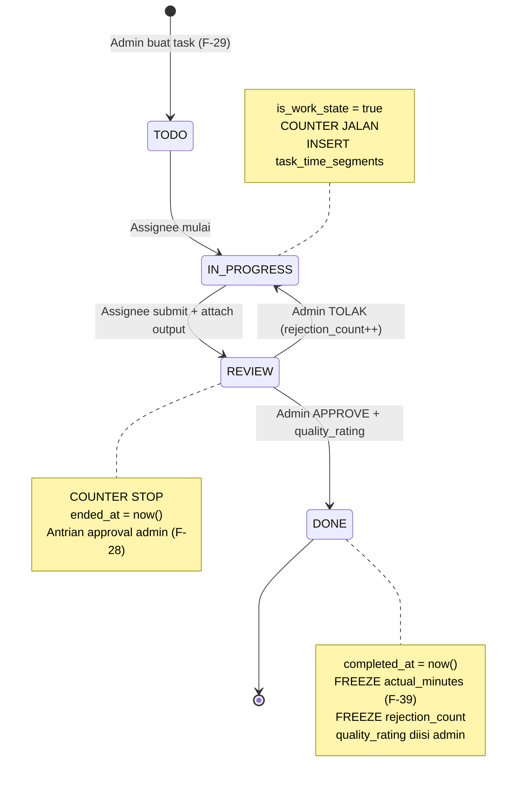
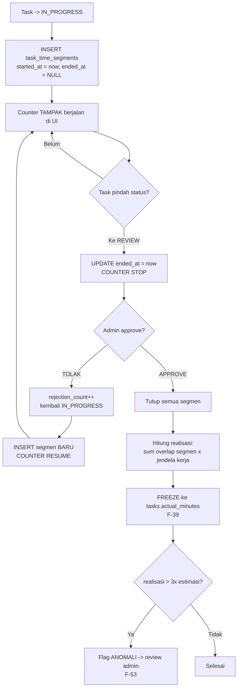
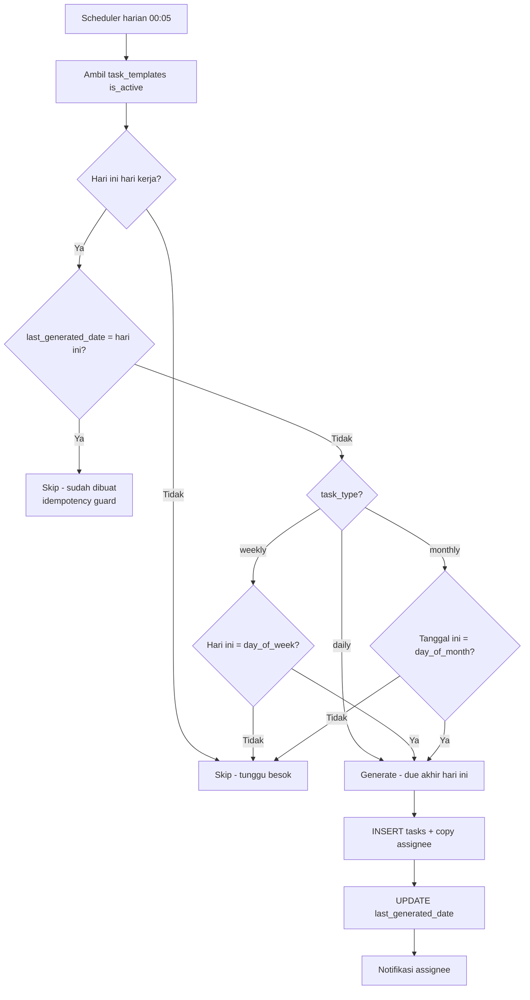
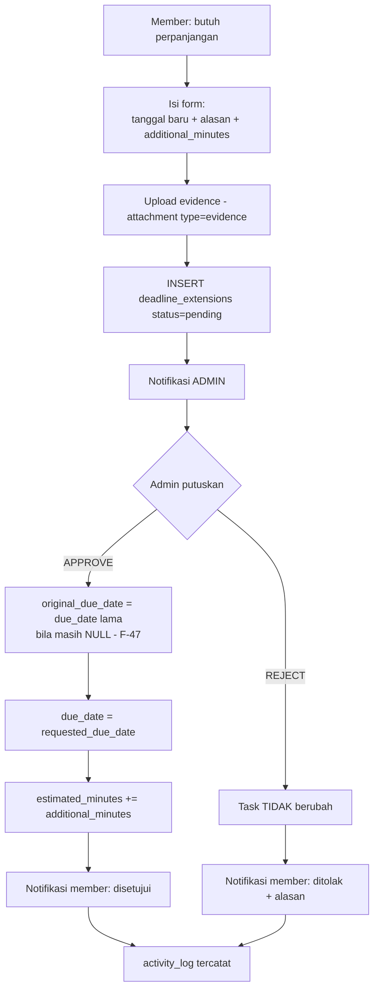
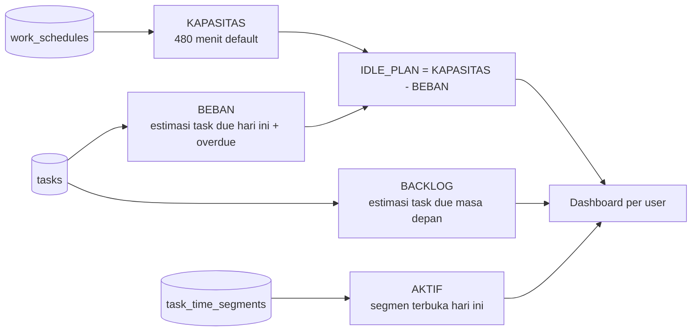
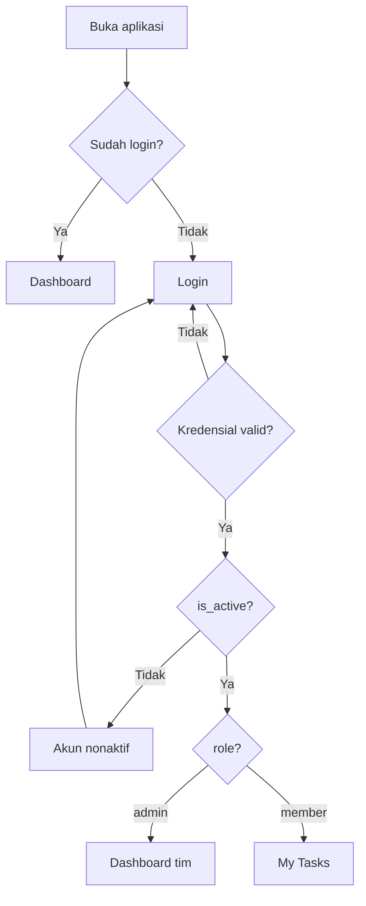
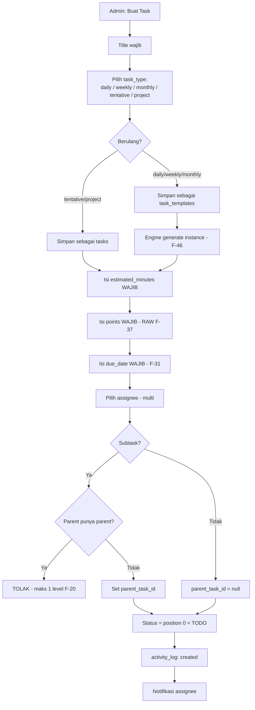
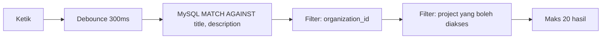
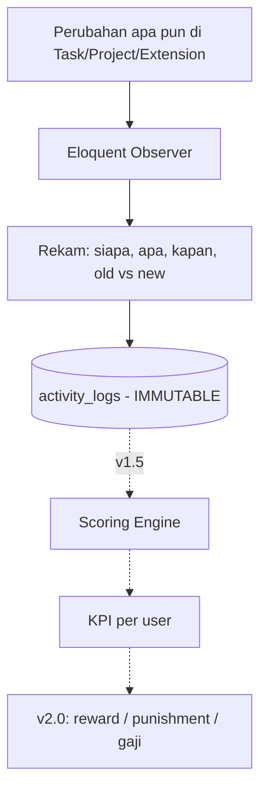

# 03 — BUSINESS FLOW & FUNCTIONAL SPEC (REVISI 2)

> **Revisi:** 2026-07-15 — semua keputusan Boss F-28..F-37 sudah tertanam
> Dokumen ini menjawab **BAGAIMANA ALURNYA**. PRD menjawab APA, Data Model menjawab DI MANA.

---

## 1. ALUR INTI — TASK LIFECYCLE

**Jantung sistem.** Semua data KPI v1.5 lahir dari sini.



**Aturan transisi — F-45 (keputusan Boss F-32 = BERURUTAN):**
- **Maju:** hanya ke `position + 1`. **TODO → DONE DITOLAK.**
- **Mundur:** bebas ke position lebih rendah (revisi/reset)
- Validasi di **service layer**, bukan cuma frontend

---

## 2. COUNTER WAKTU — F-41, F-57

**Ini fitur paling bernilai sekaligus paling rawan salah paham.**



### F-38 — COUNTER TAMPIL BERJALAN, TAPI TIDAK DIBANGUN BERJALAN

**JANGAN** simpan state "counter aktif". **JANGAN** bikin scheduler per menit.
**Simpan timestamp, hitung saat ditanyakan.** UI tampak seperti counter jalan karena frontend menghitung dari `started_at`.

**Kenapa:** scheduler mati / cron telat = **counter korup permanen**. Timestamp tidak bisa korup.

### F-57 — PAUSE & RESUME TERJADI SENDIRINYA

Boss minta: *"jam kerja habis → auto pending. Besok jendela aktif → resume."*

**Itu tidak perlu dieksekusi siapa pun.** Jam di luar jendela kerja **tidak masuk hitungan** — jadi pause/resume adalah **konsekuensi matematis**, bukan aksi.

```
IN_PROGRESS  Jumat 16:00
REVIEW       Senin 09:00
Jendela: Sen-Jum 08:00-17:00

Jumat   16:00-17:00 =  1 jam
Sabtu               =  0     (bukan hari kerja)
Minggu              =  0
Senin   08:00-09:00 =  1 jam
                     -------
REALISASI           =  2 jam    <- bukan 65 jam
```

---

## 3. ALUR RECURRING — F-46



**Aturan:**
- `daily` → tiap hari kerja, due jam `end_time` hari itu dan bisa ditentukan due jam nya
- `weekly` → tiap `day_of_week`, due akhir minggu dan bisa ditentukan due akhir minggu +due jam nya
- `monthly` → tiap `day_of_month`, due hari itu dan bisa ditentukan due akhir hari +due jam nya
- `tentative` & `project` → **TIDAK berulang**, dibuat manual admin

> **F-60 — INSTANCE LAMA TIDAK DIHAPUS.** Task kemarin belum DONE → **tetap ada, jadi overdue**. Instance baru tetap lahir. Menghapus yang lama = menghapus bukti keterlambatan = data KPI hilang.

> **F-61 — `last_generated_date` WAJIB.** Idempotency guard. Tanpa ini, scheduler jalan 2× = task duplikat = budget harian ganda = dashboard bohong.

---

## 4. ALUR EXTENSION DEADLINE — F-50



> **F-47 — `original_due_date` KRITIS.** Tanpa ini metrik on-time **bohong total** — semua task selalu "tepat waktu" karena deadline-nya digeser. KPI dihitung terhadap `original_due_date`, bukan `due_date`.

> **F-62:** Jumlah extension per user = metrik KPI v1.5 (derived dari `deadline_extensions`). Sering minta perpanjangan = sinyal, entah estimasi buruk atau beban berlebih. **Jangan langsung dihukum** — itu F-4.

---

## 5. DASHBOARD ADMIN/OWNER — F-52



**Tampilan per user:**
```
Budi   | Aktif: 2j 15m | Beban hari ini: 6j (idle 2j) | Backlog: 20j | Anomali: 0
Ani    | Aktif: 0j     | Beban hari ini: 1j (idle 7j) | Backlog: 3j  | Anomali: 1
```

### F-52 — DUA IDLE, KEDUANYA BENAR

| | Rumus | Untuk |
|---|---|---|
| **IDLE_PLAN** | KAPASITAS − Σ **estimasi** | Admin **assign** task |
| **IDLE_REAL** | KAPASITAS − Σ **realisasi** | **KPI**, setelah approve |

Contoh Boss: 2 tugas × 1j → plan idle 6j. Realisasi total 1j → **real idle 7j**. **Selisih 1 jam = sinyal KPI.**

> **Satu angka bohong. Tiga angka jujur.**
> Kalau idle hanya dihitung dari task yang **sedang dikerjakan**, maka user dengan 10 task TODO (20 jam) akan tampak **"idle 8 jam"** → admin assign lagi → overload tersembunyi. Itulah kenapa **BEBAN** dan **BACKLOG** wajib tampil.

---

## 6. MATRIKS PERMISSION — F-29 TERKUNCI

| Aksi | Admin | Member |
|------|:-----:|:------:|
| Buat/edit user | ✅ | ❌ |
| Atur jam kerja (`work_schedules`) | ✅ | ❌ |
| Buat/edit project | ✅ | ❌ |
| Atur status project | ✅ | ❌ |
| **Buat task** | ✅ | ❌ **F-29** |
| **Ubah `due_date`** | ✅ | ❌ **F-29** |
| Ubah `estimated_minutes` / `points` | ✅ | ❌ |
| Ubah status task sendiri | ✅ | ✅ |
| Upload attachment `output` | ✅ | ✅ |
| **Approve / reject REVIEW** | ✅ | ❌ **F-28** |
| Isi `quality_rating` | ✅ | ❌ |
| Ajukan extension | ✅ | ✅ |
| **Approve extension** | ✅ | ❌ |
| Lihat semua project | ✅ | ❌ (hanya yang di-assign) |
| Lihat dashboard tim | ✅ | ❌ |
| Hapus task | ✅ | ❌ |

> **F-29 menutup dua celah Goodhart terbesar:** member tidak bisa mengarang task mudah untuk kejar poin, dan tidak bisa menggeser deadline agar selalu on-time. **Perpanjangan hanya lewat extension flow yang butuh alasan + evidence + approval.**

---

## 7. ALUR AUTH



Tanpa self-signup · tanpa email verification · tanpa reset password (v1).
`is_active = false` → diblokir **tanpa dihapus** (F-16 — data KPI tetap utuh).

---

## 8. ALUR TASK CRUD — ADMIN



**Field wajib:** `title` · `task_type` · `estimated_minutes` · `points` · `due_date` · `project_id`
**Opsional:** `description` (rich text) · `assignee` · `parent_task_id` · `priority` (default normal)

---

## 9. NOTIFIKASI — F-35 (10 TRIGGER)

| # | Kejadian | Penerima |
|---|----------|----------|
| 1 | Task di-assign ke saya | assignee baru |
| 2 | Task di-unassign | assignee lama |
| 3 | Status task saya berubah | assignee lain |
| 4 | Due date **besok** | assignee |
| 5 | Task **lewat deadline** | assignee + admin |
| 6 | Task masuk **REVIEW** | admin |
| 7 | Task **di-approve** | assignee |
| 8 | Task **ditolak** + alasan | assignee |
| 9 | **Extension diajukan** | admin |
| 10 | **Extension approved/rejected** | pemohon |

> **F-36:** Pelaku aksi **tidak** dapat notifikasi atas aksinya sendiri. Kalau tidak, inbox banjir dan orang berhenti membacanya.

---

## 10. SEARCH — F-7



> **F-34:** Hasil search **WAJIB** difilter permission. Member tidak boleh menemukan task dari project yang bukan miliknya. **Bug keamanan paling umum di fitur search.**

---

## 11. ACTIVITY LOG — F-22, F-51 (TULANG PUNGGUNG)



**Log adalah satu-satunya sumber untuk 4 dari 6 metrik KPI Boss.**
Satu transisi lolos tidak tercatat = **lubang permanen**, tidak bisa direkonstruksi.
**F-22 WAJIB via Observer, bukan panggilan manual di controller** — manual = pasti ada yang kelupaan.

---

## 12. SISA PERTANYAAN

| ID | Item | Kapan |
|----|------|-------|
| **F-58** | Formula scoring: bobot points vs on-time vs quality vs rejection | **v1.5 — dari data nyata** |
| **F-59** | Task `project` 40 jam > kapasitas 8 jam/hari — wajib dipecah subtask? | sebelum v0.8 |
| **F-63** | Task assigned ke >1 orang: realisasi & poin dibagi atau digandakan? | sebelum v0.8 |

> **F-63 baru ketemu saat memetakan alur ini.** `task_user` mengizinkan multi-assignee. Kalau task 2 jam dikerjakan 2 orang — realisasinya 2 jam untuk masing-masing, atau 1 jam masing-masing? Poinnya utuh untuk berdua, atau dibagi? **Berdampak langsung ke KPI dan dashboard beban.** Belum diputuskan.
